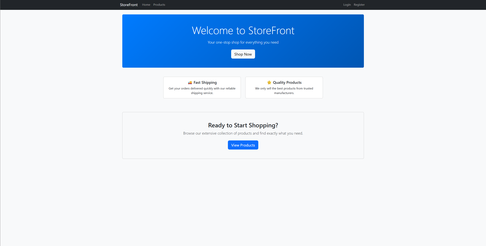

# Ecommerce Storefront

A full-stack Ecommerce Storefront application designed for modern online shopping experiences. This project leverages a powerful combination of frontend and backend technologies to deliver a fast, responsive, and feature-rich platform.

---

## Table of Contents

- [Overview](#overview)
- [Features](#features)
- [Screenshots](#screenshots)
- [Tech Stack](#tech-stack)
  - [Frontend](#frontend)
  - [Backend](#backend)
- [Getting Started](#getting-started)
- [Folder Structure](#folder-structure)
- [Contributing](#contributing)
- [License](#license)

---

## Overview

This Ecommerce Storefront provides users with a seamless shopping experience, showcasing products, managing carts, and processing orders. The application is built to be scalable, maintainable, and easy to extend.

---

## Features

- User authentication and authorization
- Product catalog with categories
- Shopping cart functionality
- Order management system
- Responsive web design
- RESTful API backend
- JWT-based security

---

## Demo's

### Home Page


### Login Page


### Registration Page


### Demo Video


---

## Tech Stack

### Frontend

- **React** — Component-based UI library
- **Vite** — Fast development build tool
- **JavaScript (ES6)** — Modern JavaScript features
- **Bootstrap** — Responsive and mobile-first UI framework
- **Fetch API** — Native browser API for HTTP requests

### Backend

- **Spring Boot** — Robust backend framework for RESTful APIs
- **Spring Data JPA** — ORM layer for database operations
- **Hibernate** — Advanced ORM for relational mapping
- **H2 Database** — In-memory database for development and testing

---

## Getting Started

### Prerequisites

- Node.js & npm (for frontend)
- Java 17+ (for backend)
- H2 database for development and testing

### Setup

**Frontend:**

```bash
cd frontend
npm install
npm run dev
```

**Backend:**

1. The application uses H2 in-memory database by default
2. Run the Spring Boot application:

```bash
cd backend
./mvnw spring-boot:run
```

3. Access H2 console at: http://localhost:8080/h2-console

---

## Folder Structure

```
Ecommerce-StoreFront/
  frontend/        # React + Vite application
  backend/         # Spring Boot REST API
  README.md
```

---

## Contributing

Pull requests are welcome! For major changes, please open an issue first to discuss what you would like to change.

---

## License

This project is open source and available under the [MIT License](LICENSE).
